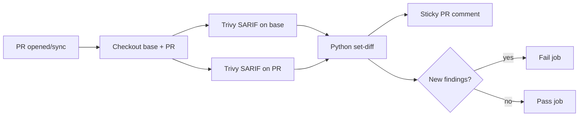

# Trivy Regression Gate PoC

Fails a pull request only when the PR branch introduces **new** vulnerability findings compared with the PR’s base branch. Pre-existing findings on the base branch do not fail the gate. Fewer findings than base also passes.

## Repository layout

| Path | Purpose |
| --- | --- |
| `.github/workflows/trivy-regression-gate.yml` | GitHub Actions workflow |
| `scripts/trivy_regression_gate.py` | SARIF diff + PR comment body |
| `demo-app/` | Intentionally vulnerable Node.js app for end-to-end testing |

## How the workflow works

**Trigger:** `pull_request` (`opened`, `synchronize`, `reopened`)

**Permissions:** `contents: read`, `pull-requests: write` (sticky PR comments via `GITHUB_TOKEN`)

### Steps

1. **Checkout base and PR separately**  
   - Base → `base/` at `github.event.pull_request.base.sha`  
   - PR head → `pr/` at `github.event.pull_request.head.sha`  
   The base ref is **not** hardcoded; it follows whatever branch the PR targets.

2. **Copy the gate script** from `pr/scripts/` into the workspace so comparison uses the PR’s version of the script.

3. **Scan both trees with the same pinned Trivy** (`aquasecurity/trivy-action@v0.36.0`)  
   - `scan-type: fs`  
   - `format: sarif`  
   - `exit-code: "0"` (Trivy itself never fails the job; the Python gate decides)  
   - All severities (`UNKNOWN` … `CRITICAL`) with `limit-severities-for-sarif: true`  
   - `ignore-unfixed: true`, `vuln-type: os,library`  
   - Outputs: `base-trivy-results.sarif`, `pr-trivy-results.sarif`

4. **Run the Python comparator** (`continue-on-error: true`) so later steps (artifacts, comment) still run even when the gate fails.

5. **Upload artifacts** (`trivy-regression-gate-reports`): both SARIFs, the comment markdown, and a JSON summary.

6. **Upsert a sticky PR comment** (`actions/github-script`)  
   - Looks for an existing bot comment containing `<!-- trivy-regression-gate -->`  
   - **Updates** that comment if found; otherwise creates one  
   - Re-runs on each push rewrite the same comment (no comment spam)

7. **Fail the job** only if the compare step’s outcome was failure (new findings vs base).

S3 / Datadog upload is currently disabled for local testing.



### Pass / fail rules

| Situation | Result |
| --- | --- |
| PR has findings not present on base (any severity) | **Fail** |
| Same finding set as base | **Pass** |
| PR has fewer findings than base (remediations) | **Pass** |
| New dependency with no known vulns | **Pass** |

Approved exceptions are documented in the failure comment as using a `.trivyignore` file (Trivy’s ignore mechanism); the workflow does not implement a separate allowlist.

---

## How the Python script works

Entry point: `scripts/trivy_regression_gate.py`

### CLI

```bash
python3 scripts/trivy_regression_gate.py \
  --base-sarif base-trivy-results.sarif \
  --pr-sarif pr-trivy-results.sarif \
  --base-ref main \
  --comment-out trivy-regression-comment.md \
  --summary-out trivy-regression-summary.json
```

| Argument | Meaning |
| --- | --- |
| `--base-sarif` | Trivy SARIF from the PR base commit |
| `--pr-sarif` | Trivy SARIF from the PR head commit |
| `--base-ref` | Branch name shown in the comment (e.g. `main`) |
| `--comment-out` | Markdown written for the sticky PR comment |
| `--summary-out` | Optional JSON summary for artifacts / logs |

Exit code: `0` if no new findings, `1` if any new findings.

### Parsing

Each SARIF `runs[].results[]` entry is turned into a `Finding`:

- **CVE / ID** ← `ruleId`
- **Package, installed version, severity, fixed version, advisory** ← parsed from Trivy’s result `message.text`
- **Target** ← location message or artifact URI (e.g. lockfile / `pkg@version`)

### Comparison key

Findings are compared by identity key:

```text
vuln_id | package | installed_version | target
```

Not by severity. Two results match only if all four parts match.

### Diff

```text
new_keys = set(pr_findings) − set(base_findings)
```

- Keys only on PR → regressions (fail + table rows)
- Keys on both → ignored (already on base)
- Keys only on base → ignored (fixed or removed; still pass)

### Comment output

**Failure:** intro text plus a markdown table:

| CVE | Package | Installed version | Severity | Fixed version | Advisory |
| --- | --- | --- | --- | --- | --- |

**Pass:** short success note with base/PR finding counts.

Both include the HTML marker `<!-- trivy-regression-gate -->` so the workflow can update the same comment.

### Local smoke test

```bash
# Produce two SARIFs (example), then:
python3 scripts/trivy_regression_gate.py \
  --base-sarif /tmp/base.sarif \
  --pr-sarif /tmp/pr.sarif \
  --base-ref main \
  --comment-out /tmp/comment.md \
  --summary-out /tmp/summary.json
echo $?
cat /tmp/comment.md
```

---

## Demo app

`demo-app/` pins old packages (`axios`, `lodash`, `minimist`, …) so Trivy has findings to compare. Use feature branches to exercise:

- **New vulnerable deps** → gate should fail and comment a table  
- **Only a clean new dep** (e.g. current `uuid`) → gate should pass  

Example PRs in this PoC: [#1](https://github.com/vlish/regression_gate_poc/pull/1) (fail), [#2](https://github.com/vlish/regression_gate_poc/pull/2) (pass).
